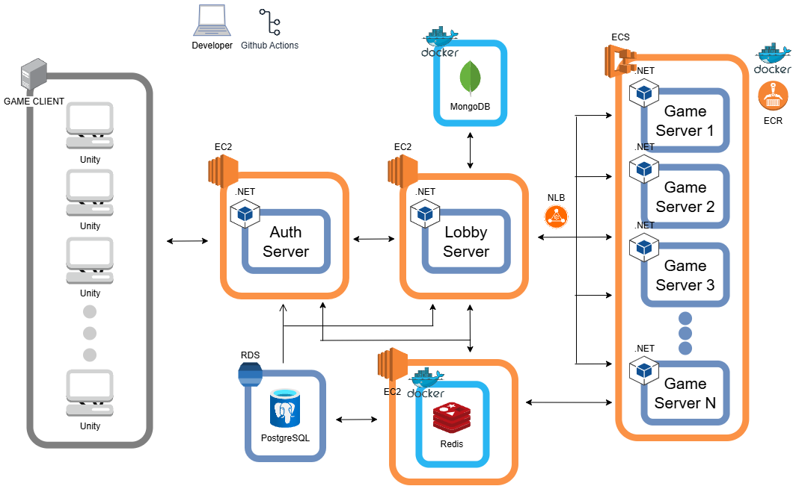

# Holy Shit

  

## 프로젝트 소개

- 게임명: Holy Shit!
- 프로젝트 기간: 2024.12 ~ 2025.02
- 게임 장르: 전략/카드
- 프로젝트 소개: **Holy Shit!** 은 보드 게임 Bang!에서 영감을 받은 실시간 전략 카드 게임입니다. 각 플레이어는 숨겨진 역할에 따라 목표를 달성해야 하며, 승리를 위해 치열한 심리전과 전략적인 플레이가 요구됩니다.

## 서비스 아키텍처

  

## 기술 구현

<b>Programming Languages</b>
 

 
<b>Programming</b>
 

 
<b>Auth & Lobby & Game Server</b>
 

 
<b>Client</b>
 

 
<b>DB</b>
 

 
<b>DevOps</b>
 

 
<b>VCS (Virsion Control System)</b>
 

 

## 주요 기능 및 구성 요소

| **사용 기술**        | **기술 설명**                                                                                                                                                                           |
| -------------------- | --------------------------------------------------------------------------------------------------------------------------------------------------------------------------------------- |
| **.NET Core**        | 고성능 게임 서버 개발에 적합하며 크로스 플랫폼 지원으로 환경 제약이 없습니다. 또한 강력한 비동기 프로그래밍 기능을 제공하여 높은 효율성을 자랑합니다.                                   |
| **AWS ECS**          | 컨테이너 오케스트레이션 서비스로 Docker 컨테이너 관리를 자동화하며, Auto Scaling을 통해 서버 자원을 최적화할 수 있습니다. 다중 가용 영역 구성을 통해 고가용성을 확보할 수 있습니다.     |
| **Docker**           | 일관된 개발 및 운영 환경을 제공하여 배포 안정성을 향상시키며, 마이크로서비스를 격리하여 독립적인 스케일링이 가능합니다. ECS와의 완벽한 통합으로 효율적인 컨테이너 관리를 지원합니다.    |
| **NLB**              | 게임 서버 간 효율적인 부하 분산을 지원하며, TCP 기반 통신에 최적화된 로드 밸런싱을 제공합니다. 빠른 장애 감지와 자동 복구 기능도 갖추고 있습니다.                                       |
| **Redis**            | 세션 관리 및 실시간 데이터 캐싱에 활용되며, 서버 간 상태 정보를 공유할 수 있습니다. 고성능 인메모리 처리를 통해 매우 빠른 읽기 및 쓰기 속도를 제공하여 실시간 데이터 캐싱에 유리합니다. |
| **PostgreSQL**       | 데이터 무결성과 트랜잭션 안정성을 보장하며, 계정 정보 등 중요한 데이터를 저장하는 데 활용됩니다. 복잡한 쿼리 처리에 강점을 보입니다.                                                    |
| **MongoDB**          | 채팅 시스템에서 고성능 처리를 지원하며, 스키마리스 구조로 유연한 데이터 관리가 가능합니다. 수평적 확장도 용이하여 대규모 데이터 처리에 적합합니다.                                      |
| **Unity**            | 클라이언트 개발 플랫폼으로, 효율적인 게임 로직 구현을 지원하며 서버와의 원활한 통신 기능을 제공합니다.                                                                                  |
| **JWT**              | 토큰 기반 사용자 인증을 제공하여 서버 부하를 줄이고 확장성을 향상시킵니다. 안전한 사용자 인증을 보장합니다.                                                                             |
| **Protocol Buffers** | 효율적인 데이터 직렬화를 지원하며 다양한 언어와의 호환성을 통해 서버-클라이언트 간 통신이 용이합니다. 네트워크 대역폭 최적화에도 유리합니다.                                            |
| **GitHub Actions**   | 자동화된 CI/CD 파이프라인을 구축하여 Docker 이미지를 자동으로 빌드하고 ECR에 푸시할 수 있습니다. 테스트 자동화 및 품질 관리를 지원하며, 브랜치 기반 배포 전략도 구현할 수 있습니다.     |

## 관련 링크

- 프로젝트 문서 
  [브로셔](https://dune-poultry-b4f.notion.site/Holy-Shit-18a266df1491805dbb78c9ed6f672c5d?pvs=4)
- AUTH 서버 
  [dotnet-holyshit-auth-server](https://github.com/HolySSA/dotnet-holyshit-auth-server)
- LOBBY 서버 
  [dotnet-holyshit-lobby-server](https://github.com/HolySSA/dotnet-holyshit-lobby-server)
- GAME 서버 
  [dotnet-holyshit-game-server](https://github.com/HolySSA/dotnet-holyshit-game-server)
- 클라이언트 
  [holyshit-client](https://github.com/HolySSA/holyshit-client)
- DB 서버 
  폐쇄.
